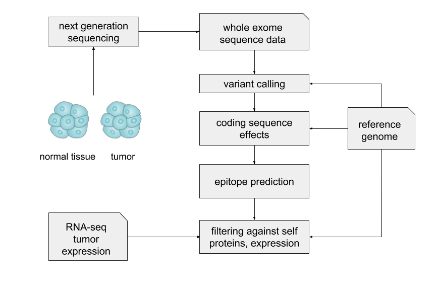

Neoepitope Prediction
=====================

About
-----

It is now known that tumors elicit adaptive immune responses and that the antigens driving effective T cell response are generated from somatically mutated genes. Cancer vaccines and adoptive T cell therapy therefore depends on identification of these patient-specific potential neo-epitopes that might be targeted. This is achieved by applying whole exome sequencing of matched cancer and normal tissues, usually along with RNA-seq quantification of tumour gene expression. Variant calling is then performed, the new mutated peptides extracted and potential epitopes predicted. The computational aspect is broadly outlined below. There are several other software pipelines designed for this task, notably pvactool_ and MuPeXI. Users are encouraged to try at least one of these also.

.. _pvactool: http://pvactools.readthedocs.io/en/latest/pvacseq/

Method
------

The program currently accepts vcf or maf files that have been output from a variant calling program. In future this step will be added so that the user can provide raw reads. The vcf/maf file is processed using the `varcode` python library for variant effect prediction to estimate potential mutated coding sequence. The resulting mutated sequence regions are broken up into peptides which are then filtered for similarity to the self proteome. MHC binding predictions are then performed on the remainder.

Usage and Configuration
------------------------

The pipeline is run via the same command line tool using `epitopepredict`. This uses the same text confguration file to provide the inputs and settings. Settings specific to neoepitope prediction are in the [neoepitope] section. These are explained below. Running the tool is then as simple as calling this command::

    epitopepredict -c <yourfilename>.conf -n

You can test the neoepitope pipeline after installing by running::

    epitopepredict -n -t

This will check that the human reference genome is available. (Note for users running the snap package: these files will be placed in your home directory usually under */home/user/snap/epitopepredict/x1/.cache/pyensembl/*.  If you uninstall the package you can also delete this folder to clear space).

neopredict accepts one or more vcf or maf files which have been created from a variant calling program. If more than one file, they should be comma separated. These file names specified in the [neoepitope] of the configuration file::

    [neoepitope]
    vcf_files =
    maf_files =

The remaining options not in this section are in the other sections covered in the command line interface section of the docs. For example you can specify the prediction algorithm, alleles and length of peptides in those sections.

References
----------

* Y. C. Lu and P. F. Robbins, “Cancer immunotherapy targeting neoantigens,” Semin. Immunol., vol. 28, no. 1, pp. 22–27, 2016.
* M. Efremova, F. Finotello, D. Rieder, and Z. Trajanoski, “Neoantigens generated by individual mutations and their role in cancer immunity and immunotherapy,” Front. Immunol., vol. 8, no. November, pp. 1–8, 2017.
* N. P. Restifo, M. E. Dudley, and S. A. Rosenberg, “Adoptive immunotherapy for cancer: Harnessing the T cell response,” Nat. Rev. Immunol., vol. 12, no. 4, pp. 269–281, 2012.
* A. M. Bjerregaard, M. Nielsen, S. R. Hadrup, Z. Szallasi, and A. C. Eklund, “MuPeXI: prediction of neo-epitopes from tumor sequencing data,” Cancer Immunol. Immunother., vol. 66, no. 9, pp. 1123–1130, 2017.
* J. Hundal et al., “pVAC-Seq: A genome-guided in silico approach to identifying tumor neoantigens,” Genome Med., vol. 8, no. 1, p. 11, 2016.
* A. Rubinsteyn et al., “Computational pipeline for the PGV-001 neoantigen vaccine trial,” Front. Immunol., vol. 8, no. January, p. 1807, 2017.